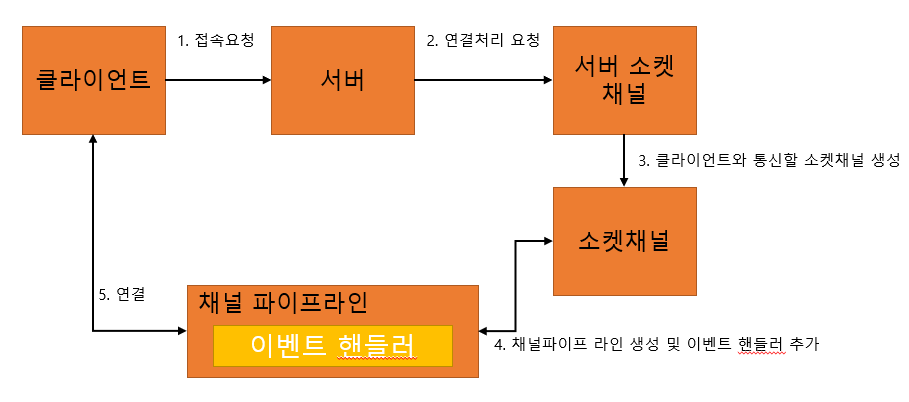
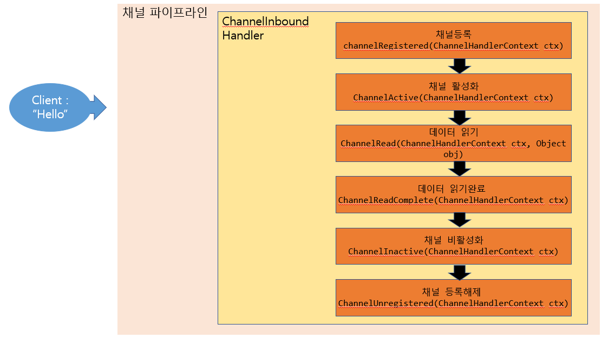

## 채널 파이프라인과 코덱
채널 파이프라인은 채널에서 발생하는 이벤트가 이동하는 통로 이다.  
코덱은 채널 파이프라이 안에서 이벤트를 제어하는 핸들러를 상속받은 구현체 이다.

### 채널 파이프라인 구조
- 서버 기준으로 채널 파이프라인의 위치는 다음과 같다

-전기에 비유하면 소켓채널은 발전기 이다. 채널파이프라인은 전선구간이고 클라이언트는 가전기기이다. 

### ChannelHandlerContext
이벤트핸들러에서 제공하는 이벤트들을 ChannelHandlerContext 객체를 파라미터로 받는다. 이 객체는 다음과 같은 역할을 한다. 
1. 채널에 대한 입출력 처리
2. 파이프 라인에 관한 이벤트 호출

### 이벤트 핸들러
- 소켓채널에서 발생한 이벤트를 처리하는 인터페이스
- 인바운드 이벤트 핸들러 인터페이스  
클라이언트가 서버에 접속하여 "Hello" 라는 문자열 데이터를 전송하고 연결을 끊었다고 가정해보자.
  

- 아웃바운드 이벤트 핸들러  인터페이스  
  인바운드 핸들러와 비슷하게 사용자의 요청에 따라 이벤트가 발생한다. 연결 요청, 데이터 전송, 소켓 닫기 등의 이벤트를 갖고있다.

### 코덱
압축알고리즘을 코덱이라고 한다. JPG 코덱을 사용한 파일은 JPG 확장자를 갖는다.  
파일을 생성할때 코덱을 이용하여 인코딩하고 열어볼때는 디코딩 한다.  
Netty 에서도 다양한 코덱들이 있다.  
bytes, string 부터 marshalling, http 등의 방식으로 데이터를 인코딩하고 디코딩 한다.  
[Http 코덱 예제](https://github.com/jsk2606/NettyCode/tree/main/src/main/java/D_codec)
