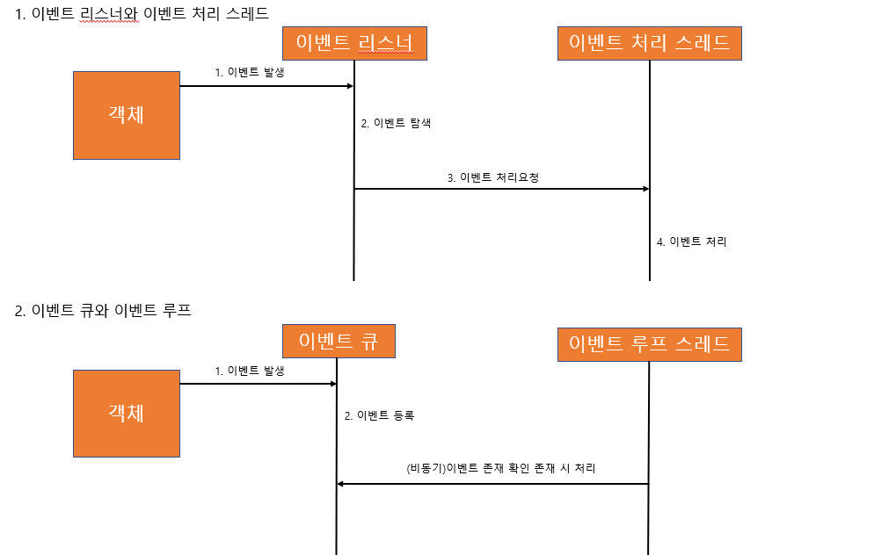
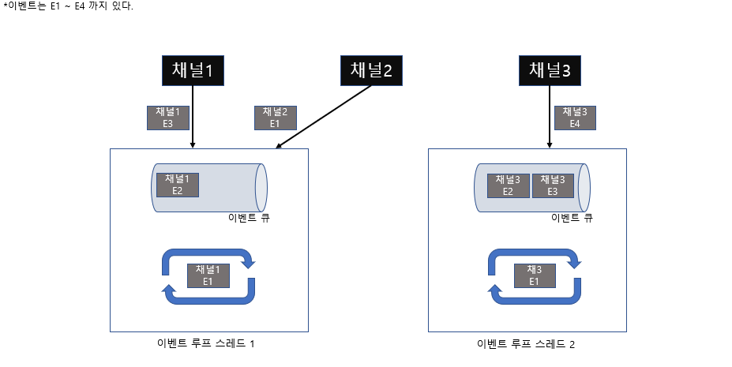

### 이벤트 루프
1. 이벤트 리스너와 이벤트 처리 스레드 방식  
이벤트 리스너에 로직을 등록하고 이벤트 발생 시 처리 스레드에서 로직을 실행한다.
2. 이벤트 큐와 이벤트 루프  
이벤트 큐에 이벤트를 등록하고 이벤트 큐에  들어오면 해당 이벤트를 이벤트 루프가 꺼내어 실행한다.   
  

### 단일 스레드와 다중 스레드 이벤트 루프
1. 단일 스레드  
장점 : 루프의 구현이 단순하고 이벤트 큐에 입력된 순서대로 처리하기에 예측이 가능하다.  
단점 : CPU 자원을 효율적으로 사용하지 못하기에 작업이 지연되면 그 뒤에 이벤트들도 모두 영향을 받는다.  
2. 다중 스레드
장점 : 병렬처리를 하기에 CPU를 효율적으로 사용 가능하다. 단일 스레드에 비해 성능이 기하급수적으로 상승한다.  
단점 : 구현이 복잡하고 자원을 적당히 제한 하지않으면 과도한 가비지 컬렉션이나 OOM 에러 등의 치명적인 리스크가 있다.  

### Netty의 이벤트 루프
Netty는 단일과 다중 스레드 모두 사용 가능하다. 그런데 다중 스레드에서도 실행순서가 보장된다.
* Netty 이벤트는 채널에서 발생한다.
* 이벤트 루프 객체는 이벤트 큐를 가지고 있다.
* Netty 채널은 하나의 이벤트 루프에 연결된다.  

